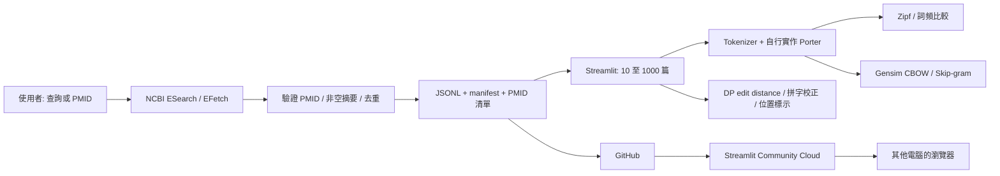

# BioScope IR · HW2 架構

日期：2026-09-28。作者：Codex。

## 目標與現況

資料夾原本只有作業 PDF。建立 Python / Streamlit 網站，預載 1,000 篇同主題 GLP-1 PubMed abstracts，提供 Zipf、Porter、Word2Vec、搜尋與拼字校正。GitHub 保存程式及資料快照，Streamlit Community Cloud 執行 Python；GitHub Pages 不執行此應用程式。這不是醫療建議系統，也不下載全文。

## 資料流

## 模組與決策

- `bioir/pubmed.py`：官方 E-utilities，分批、限速、重試；略過無摘要文章並補足，未達目標明確報錯。固定查詢與時間記錄，保留摘要來源。
- `scripts/prepare_corpus.py`：獨立資料預備工具。預載資料隨 repo 保存，網站啟動不必呼叫 PubMed。
- `bioir/porter.py`、`bioir/text.py`：Porter 1980 自行實作（非直接套用 NLTK）；保留 GLP-1 等含連字號 token；不需下載 NLTK 語料。
- `bioir/retrieval.py`：DP Levenshtein、詞頻優先的候選字、原文 token 位置與安全 HTML 標示。
- `bioir/analysis.py`：Zipf log-log 比較、Gensim Word2Vec 兩種模型，明確標示使用函式庫。預設只分析摘要，標題可選。
- `app.py`：繁中頁面、參數、圖表、下載。自訂資料只留各瀏覽器 session；雲端不假設磁碟寫入會永久保存。

## 驗證與風險

測試公開 Porter 範例、DP 距離、搜尋位置與 HTML escaping、XML 結構化摘要解析、去重及不足篇數處理、1000 筆真實資料完整性、Streamlit AppTest 和 Word2Vec 訓練。GitHub/Streamlit 登入或 OAuth 若不可用，完成所有本機程式與可部署封裝後明確記錄阻礙。

## 報告節點

建立架構報告、實作完成報告、最終驗證與部署報告於 `docs/reports/`。
