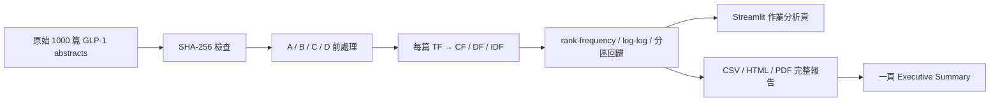

# 新版 Project 2 實作範圍

2026-09-30 · Codex

依使用者要求，以原始 `data/glp1_1000.jsonl` 快照（不重新下載、不改動原始摘要）完成 `project-2-details-20260929-1.pdf` 的 Parts I–IX、RQ1–RQ5、Final Challenge 與一頁 Executive Summary。省略 Optional Challenge 的跨領域比較。原有搜尋／Word2Vec 保留為額外展示，不列為新版作業必做分析。

## 設計

新增 `bioir/experiments.py` 計算每篇 TF、collection CF、DF、natural-log IDF、Zipf 迴歸與區間診斷。A 保留獨立標點 token；B 移除獨立標點但保留 GLP-1 等內部連字號；C 在 B 基礎上移除版本固定的 stoplist；D 在 C 基礎上做 Porter stemming。純數字在全部條件中均排除，避免混淆比較。

以 B（保留停用詞、移除獨立標點）為主要 Zipf 分析。全排名估計之外，預先固定前 10%、中間 80%、後 10% 三區，保留全域 rank 做區間迴歸；同頻平台上 R² 未定義，不當成良好擬合。報告 slope、intercept、k=-slope、R²、log10 RMSE，討論 OLS 與 log-log R² 的限制。

新增 `scripts/build_assignment.py` 產出真正可重現的分析 CSV、圖表、完整報告 PDF/HTML、Executive Summary PDF。正式結果固定使用全部 1000 篇摘要；網站互動子集結果明確另行標示。

## 驗證

以手算小語料驗證 TF/CF/DF/IDF；測試四條件的差異、synthetic 1/r 回歸、constant-tail R²、原始語料 SHA-256、完整 Streamlit 工作流程；檢查輸出 PDF 頁數與實際版面。完整報告 8 頁、一頁摘要 1 頁，Part IX 343 words。

49 項本機測試及 Linux CI 通過。已以 main / app.py / Python 3.12 部署到 https://bioscope-glp1-ir.streamlit.app/ 。獨立未登入瀏覽器可開啟首頁，圖表與資料正確；下載 PDF 的 SHA-256 與本機檔案一致。部署畫面與驗證記錄見 docs/reports/。
